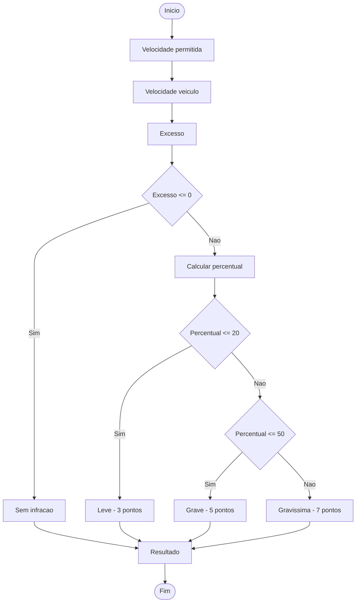

# Pontuação de motorista

```mermaid

flowchart TD
    A([Inicio]) --> B[Velocidade permitida]
    B --> C[Velocidade veiculo]
    C --> D[Excesso]

    D --> E{Excesso <= 0}
    E -- Sim --> F[Sem infracao]
    E -- Nao --> G[Calcular percentual]

    G --> H{Percentual <= 20}
    H -- Sim --> I[Leve - 3 pontos]
    H -- Nao --> J{Percentual <= 50}

    J -- Sim --> K[Grave - 5 pontos]
    J -- Nao --> L[Gravissima - 7 pontos]

    F --> M[Resultado]
    I --> M
    K --> M
    L --> M

    M --> N([Fim])
```
