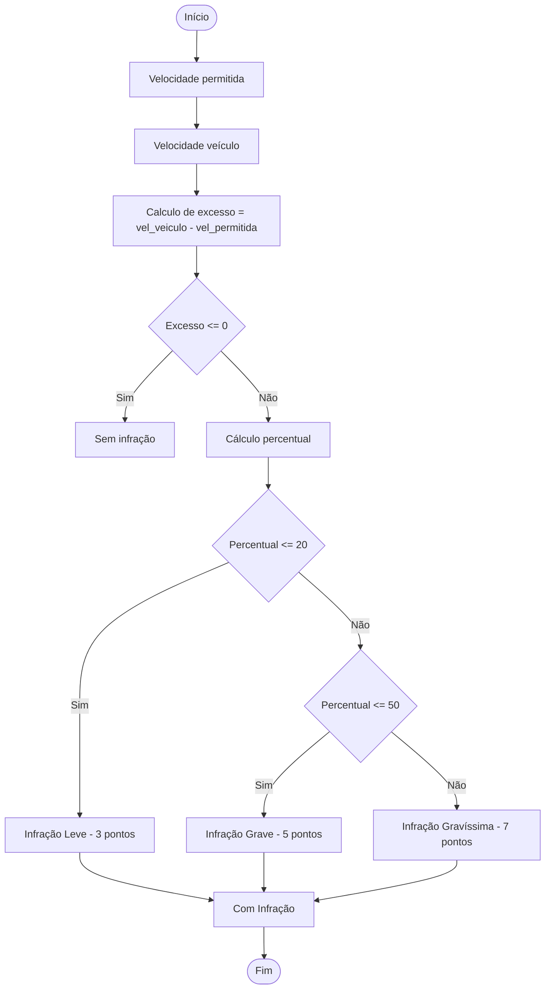

# Pontuação de motorista

```mermaid

flowchart TD
    A([Início]) --> B[Velocidade permitida]
    B --> C[Velocidade veículo]
    C --> D[Calculo de excesso = vel_veiculo - vel_permitida]
    D --> E{Excesso <= 0}
    E -- Sim --> F[Sem infração]
    E -- Não --> G[Cálculo percentual]

    G --> H{Percentual <= 20}
    H -- Sim --> I[Infração Leve - 3 pontos]
    H -- Não --> J{Percentual <= 50}

    J -- Sim --> K[Infração Grave - 5 pontos]
    J -- Não --> L[Infração Gravíssima - 7 pontos]

    I --> M[Com Infração]
    K --> M
    L --> M

    M --> N([Fim])
```
